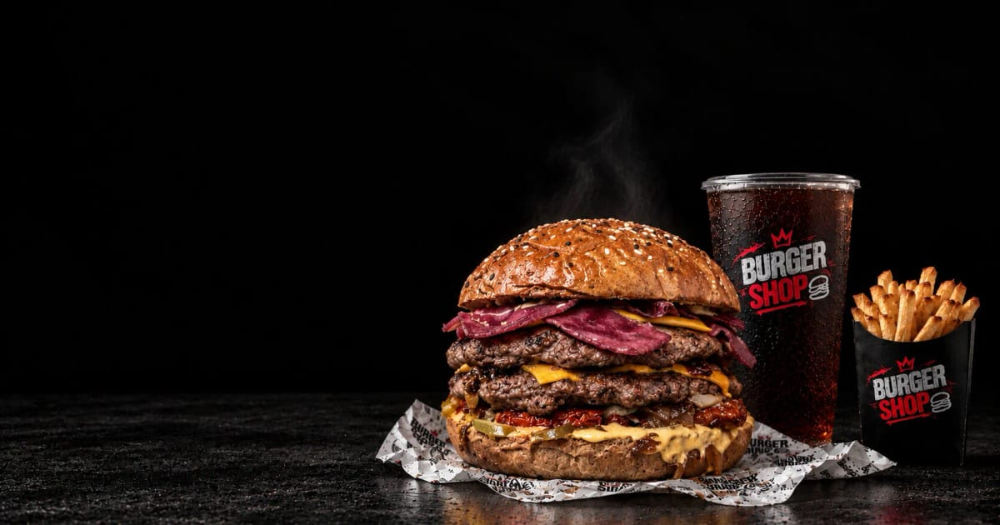

# Burger Shop

A single-page website for a fictional smash-burger restaurant, built as a personal front-end design study.

> **Not deployed yet.** When it is, set `NEXT_PUBLIC_SITE_URL` to the live origin and drop the link here.

---

## About

The brief I set myself was to design a restaurant homepage that doesn't look like a template. That meant committing to a strong art direction — a dark, high-contrast palette, oversized condensed display type, torn-paper and hand-script details, and full-bleed food photography — and then building it to production standards rather than stopping at "looks good on my laptop."

So the page is also a working demonstration of the fundamentals: it ships real metadata and structured data, passes an accessibility baseline, keeps its images small, and sets security headers by default.

## Highlights

**Art direction**

- Five-section single-page flow — hero, menu, "make it a meal", brand story, and an order footer — each with its own layout logic rather than one repeated card grid.
- A deliberate type pairing: **Anton** for display headings, **Playfair Display** for editorial body copy, **Caveat** for hand-written accents, and **Montserrat** for the hero. All self-hosted and preloaded via `next/font`.
- Custom SVG and photographic details — the hand-drawn oval around "Choose your favorite.", the torn-paper edge on the menu section, the paint-brush stroke, and the half-cheeseburger cutout in the footer.

**Engineering**

| Area | What was done |
|---|---|
| **Performance** | Image payload cut from **17 MB to 4.3 MB**. Line art converted to lossless WebP, photos to near-lossless WebP with per-asset pixel-diff verification. Explicit `width`/`height` on every image, `loading="lazy"` below the fold, `fetchpriority="high"` on the LCP hero. `next/image` serving AVIF + WebP. |
| **SEO / AEO / GEO** | Per-page metadata with canonical and Open Graph, `robots.ts` explicitly allowing 27 AI crawlers, `sitemap.ts`, and `llms.txt` so the menu and prices are machine-readable. |
| **Structured data** | `WebSite` + `Organization` sitewide, plus a `Menu` graph on the homepage that is **generated from the same array the price list renders** — so the schema can't drift from visible content. |
| **Accessibility** | Semantic landmarks, one `<h1>`, skip link, descriptive alt text with `alt=""` on decorative images, labelled controls, and a mobile menu that closes on toggle, `Escape`, or outside click with correct `aria-expanded`/`aria-controls`. `prefers-reduced-motion` is respected. |
| **Security** | Content-Security-Policy, `X-Content-Type-Options`, `frame-ancestors 'none'`, `Referrer-Policy`, `Permissions-Policy`, and HSTS in production. Framework version header disabled. |
| **Responsive** | Mobile-first, verified from 320 px through 1700 px+, including the awkward 1024–1440 range where the menu layout switches from stacked to two-column. |

## Tech stack

- **[Next.js 16](https://nextjs.org)** (App Router, Turbopack) — statically prerendered
- **React 19**
- **TypeScript** in strict mode
- **[Tailwind CSS v4](https://tailwindcss.com)** with design tokens declared in `@theme`
- **[lucide-react](https://lucide.dev)** for the icon set

## Getting started

```bash
npm install
npm run dev
```

Open [http://localhost:3000](http://localhost:3000).

```bash
npm run build   # production build (all routes prerender statically)
npm start       # serve the production build
npm run lint    # eslint
```

## Environment

| Variable | Default | Purpose |
|---|---|---|
| `NEXT_PUBLIC_SITE_URL` | `https://burgershop.example.com` | Absolute base URL used for the canonical tag, Open Graph, `sitemap.xml`, `robots.txt` and JSON-LD `@id` values. Set this to your deployed origin. |

There are no secrets, APIs, databases or server routes — the site is entirely static.

## Project structure

```
src/
├── app/
│   ├── layout.tsx      # fonts, metadata, sitewide JSON-LD
│   ├── page.tsx        # homepage composition + Menu JSON-LD
│   ├── globals.css     # Tailwind import, design tokens, base styles
│   ├── robots.ts       # generated robots.txt (AI crawlers allowed)
│   └── sitemap.ts      # generated sitemap.xml
├── components/
│   ├── Navbar.tsx      # fixed header, scroll-aware, mobile menu
│   ├── Hero.tsx        # LCP section
│   ├── MenuSection.tsx # price list + featured burgers
│   ├── MealSection.tsx # fries/drink upsell
│   ├── StorySection.tsx
│   └── Footer.tsx
├── data.ts             # menu items — single source for UI and schema
└── site.ts             # site URL, title, description, OG image
public/                 # optimized WebP assets, llms.txt
assets/source-images/   # original unoptimized files (gitignored)
```

## Assets

The photography is stock placeholder imagery used to demonstrate layout and art direction; the type, composition, layout system, and SVG details are original. Image processing was done with [sharp](https://sharp.pixelplumbing.com) — line art to lossless WebP, continuous-tone images to near-lossless WebP, each verified against the original with a pixel-diff so the optimization is provably sub-threshold rather than eyeballed.

## Status

This is a single homepage and is intentionally scoped that way. Still to build: value-proposition and testimonial sections, an FAQ block (which would unlock `FAQPage` structured data), and real menu/order routes.

---

Built by [Jimwel](https://github.com/Jimwel0406).
